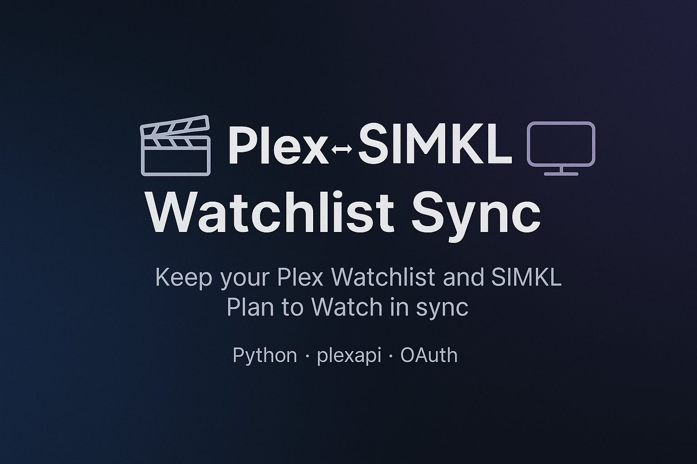

Keep your **Plex Watchlist** and **SIMKL “Plan to Watch”** list aligned.  
This tool compares both lists and applies additions/removals so they end up in sync — safely and predictably.

---

## ✅ Features

- **Two-way sync** between Plex and SIMKL.
- **Clear modes**:
  - **`two-way` (default)** — symmetric sync.  
    - **First run:** *adds only* (seeds a local snapshot to avoid accidental deletes).  
    - **Subsequent runs:** *adds and deletions* both ways, based on deltas vs the snapshot.
  - **`mirror`** — make one side exactly match the other (adds + deletions) using `source_of_truth` (`plex` or `simkl`).
- **Built-in SIMKL OAuth redirect helper** (`--init-simkl redirect`) to obtain tokens easily.

---

## 🧩 How it works

1. Read Plex Watchlist 
2. Build ID sets (IMDB/TMDB/TVDB/slug when available) for stable matching across both services.
3. Compute differences with SIMKL
4. Apply changes based on your configured mode:
   - **two-way (first run):** add-only on both sides, snapshot saved to `state.json`.
   - **two-way (later runs):** add/remove in both directions using the snapshot to detect deltas.
   - **mirror(plex):** make SIMKL exactly match Plex (add to SIMKL, remove from SIMKL).
   - **mirror(simkl):** make Plex exactly match SIMKL (add/remove in Plex via `plexapi`).

## 🚀 Getting Started

You can run **Plex ⇄ SIMKL Watchlist Sync** in two ways:

### Option A — Docker (recommended for servers/NAS)

Pull and run:

### Pull the image
```bash
docker pull ghcr.io/cenodude/plex-simkl-watchlist-sync:latest
```
### Run the container
```bash
docker run -d --name pss \
  -p 8787:8787 \
  -v "$PWD/config:/config" \
  -e TZ="Europe/Amsterdam" \
  -e PLEX_ACCOUNT_TOKEN="" \
  -e SIMKL_CLIENT_ID="" \
  -e SIMKL_CLIENT_SECRET="" \
  ghcr.io/cenodude/plex-simkl-watchlist-sync:latest
```
Or use Docker-Compose
### docker-compose.yml

```yaml
version: "3.8"

services:
  pss:
    image: ghcr.io/cenodude/plex-simkl-watchlist-sync:latest
    container_name: plex-simkl-sync
    environment:
      TZ: Europe/Amsterdam
      PLEX_ACCOUNT_TOKEN: ""   # your Plex token (leave empty if not using ENV)
      SIMKL_CLIENT_ID: ""      # your SIMKL client_id (leave empty if not using ENV)
      SIMKL_CLIENT_SECRET: ""  # your SIMKL client_secret (leave empty if not using ENV)
    volumes:
      - ./config:/config
    ports:
      - "8787:8787"             # only needed on first run for OAuth
    restart: unless-stopped
```

#### First-time setup
1. After container starts, a `config.json` is created inside `./config/`.  
2. **Edit `config.json`** and add:
   - Your **Plex account token**  
   - Your **SIMKL client_id** and **client_secret** (from SIMKL Developer app)  
3. Restart the container.

#### OAuth flow
- On restart, the container will show a **SIMKL authorization URL** in the logs.  
- Open this URL in your browser and complete login.  
- Tokens will be saved in `./config/config.json`.  
- Restart the container again for normal hourly sync.  

#### Notes
- Default sync runs every 24 hours. Change with:
  ```bash
  -e CRON_SCHEDULE="*/15 * * * *"
  ```
---

### Option B — Manual Python

Requirements:
- **Python 3.8+**
- Python packages: **`requests`**, **`plexapi`**
- PlexAPI 4.17.1 or higher. Validate if you have the correct version or pip install -U plexapi
- A `config.json` next to the script (auto-created on first run)
- A SIMKL application (client id/secret)
- A Plex account token
  
```bash
pip install -U requests plexapi
```

First-time setup:

1. Create `config.json`.  
   ```bash
   python plex_simkl_watchlist_sync.py
   ```
2. Edit `config.json` with your Plex account token and SIMKL client credentials.  

OAuth:

```bash
python plex_simkl_watchlist_sync.py --init-simkl redirect --bind 0.0.0.0:8787
```

Then run sync normally:

```bash
python plex_simkl_watchlist_sync.py --sync
```

That’s it. Pick **Docker** if you want it automated on a server, or **manual** if you run it locally.

---

## ⚙️ Configuration (`config.json`)

A starter file is created on first run:

```json
{
  "plex": {
    "account_token": ""          // REQUIRED: Your Plex *account* token (not a server token)
  },
  "simkl": {
    "client_id": "",             // REQUIRED: SIMKL API Client ID (from creating an app in SIMKL)
    "client_secret": "",         // REQUIRED: SIMKL API Client Secret
    "access_token": "",          // Leave blank; script fills after OAuth
    "refresh_token": "",         // Leave blank; script fills after OAuth
    "token_expires_at": 0        // Leave as 0; script manages expiry time (unix epoch seconds)
  },
  "sync": {
    "enable_add": true,          // Allow adding missing items
    "enable_remove": true,       // Allow removing extras (used in mirror and two-way w/ deletions)
    "verify_after_write": true,  // Re-read both sides after changes to confirm counts
    "bidirectional": {
      "enabled": true,           // Enable bi-directional sync
      "mode": "two-way",         // "two-way" (union/adds; deletions when state exists) or "mirror"
      "source_of_truth": "plex"  // Used only for "mirror": "plex" or "simkl"
    }
  },
  "runtime": {
    "debug": false               // Set true for verbose logs
  }
}
```

### Keys

- `plex.account_token`: Your Plex account token (see “Getting a Plex token” below).
- `simkl.*`: Credentials and tokens for SIMKL.
- `sync.enable_add` / `sync.enable_remove`: Global toggles for adding/removing.
- `sync.verify_after_write`: Reserved for future verification logic.
- `bidirectional.enabled`: `true` → two-way or mirror; `false` → one-way Plex → SIMKL.
- `bidirectional.mode`:
  - `"two-way"` — symmetric, with state snapshot and real deletions after first run.
  - `"mirror"` — make one side exactly match the other using `source_of_truth`.
- `bidirectional.source_of_truth`: `"plex"` or `"simkl"` (used only in `mirror`).

---

## 🔐 SIMKL APP

### 1) Create your SIMKL app
- Go to **simkl.com → Developers** and create an app.
- Add the **exact** redirect URI you will use (must match what you launch the helper with):
  ```
  http://<HOST>:8787/callback
  ```
  > `<HOST>` must be reachable from the browser you’ll use to authorize (server IP/hostname for headless, or `127.0.0.1` for same-device).

---

## 🎟 Getting a Plex account token

This project requires a Plex account token (`plex.account_token`) stored in `config.json`.  
A helper script is included to make this simple: **`plex_token_helper.py`**.

Run:

```bash
python plex_token_helper.py --fetch
```

What happens:

- The helper detects whether you are running **inside a container** or **on your host**:
  - **Container** → saves token into `/config/config.json`
  - **Host** → saves token into `./config.json`
- It will print a short **PIN code** and a link to `https://plex.tv/link`
- On **any device with a browser** (PC, phone, tablet), open that link and enter the PIN
- The script polls automatically until the link is completed
- Each PIN is valid for ~15 minutes. If one expires, the helper automatically requests a new code (up to 3 tries)
- Once successful, your `config.json` will be created/updated with:

---

## 🖥️ Usage

Show help (and all examples/flags):

```bash
./plex_simkl_watchlist_sync.py --help
```

### CLI flags

```
--sync                         Run synchronization using config.json
--init-simkl redirect          Start local redirect helper for SIMKL OAuth
--bind HOST:PORT               Bind address for redirect helper (default 0.0.0.0:8787)
--open                         Try to open the SIMKL auth URL on this device
--plex-account-token TOKEN     Override Plex token from config.json for this run
--debug                        Verbose logging
--version                      Print script and plexapi versions
--reset-state                  Delete state.json (next --sync will re-seed safely)
```

---

## 🗃️ Files the script writes

- `config.json` — your configuration + SIMKL tokens.
- `state.json` — local snapshot that enables **real two-way deletions** on subsequent runs.

> If `state.json` is missing, the script treats the run as “first run” and does **adds only**.

---

# 🛠️ Troubleshooting

## Out-of-sync or repeated `NOT EQUAL`
If a run fails partway or the two lists drift (e.g., you see `Post-sync: Plex=X vs SIMKL=Y → NOT EQUAL` on repeats), do a safe reset + one-time mirror, then return to two-way:

**1) Reset local snapshot**
```bash
./plex_simkl_watchlist_sync.py --reset-state
```
This removes `state.json` so the next run reseeds cleanly.

**2) Temporarily switch to MIRROR mode**  
Open `config.json` and set the sync block like this (pick *one* source of truth):
```json
"sync": {
  "enable_add": true,
  "enable_remove": true,
  "bidirectional": {
    "enabled": true,
    "mode": "mirror",
    "source_of_truth": "plex"   // or "simkl"
  },
  "activity": {
    "use_activity": true
  }
}
```
- `"plex"` = make **SIMKL match Plex** (adds/removes on SIMKL).
- `"simkl"` = make **Plex match SIMKL** (adds/removes on Plex).

> ⚠️ Mirror is **destructive** on the target side (it will remove extras). Choose the direction carefully.

**3) Run a one-time mirror**
```bash
./plex_simkl_watchlist_sync.py --sync --debug
```
Confirm the final line shows `→ EQUAL`.

**4) Switch back to two-way**
Edit `config.json` again:
```json
"bidirectional": {
  "enabled": true,
  "mode": "two-way",
  "source_of_truth": "plex"
}
```
Then run:
```bash
./plex_simkl_watchlist_sync.py --sync
```
This saves a fresh snapshot (`state.json`) once counts match.

---

## `plexapi` not installed or too old
Error mentions plexapi or an unsupported call. Fix by upgrading in the **same** Python environment:
```bash
pip install -U plexapi
```

## Plex watchlist 404 via `plexapi`
- You may see errors like “Section 'watchlist' not found!”.
- The script will **automatically fall back** to **Plex Discover HTTP** *for reading only*.
- **Writes to Plex still require `plexapi`**. If add/remove fails, upgrade `plexapi`.

## Plex add/remove fails (400/404)
Usually a sign `plexapi` needs an update for the latest Plex Discover endpoints. Upgrade:
```bash
pip install -U plexapi
```

## SIMKL 401/403
Your SIMKL access token may be expired or the client credentials are wrong.
- Re-run the OAuth helper and ensure the **redirect URI** in SIMKL matches the one printed by the script.

## Redirect helper unreachable
- Ensure any container/VM port mappings allow inbound to the chosen port (default `8787`).
- If binding `0.0.0.0`, the helper prints a URL you can open from another device on the network.


---


## 📣 Support

Issues and suggestions are welcome. When reporting problems, include:
- Your Python version and OS
- `plexapi` version (`./plex_simkl_watchlist_sync.py --version`)
- Whether you ran with `--debug`
- Redacted logs that show the failing operation

---

## 🔒 Disclaimer

This project is a **community-made** utility and is **not affiliated with, endorsed by, or sponsored by** Plex, Inc. or SIMKL. All product names, logos, and brands are property of their respective owners.

- **No Warranty.** The software is provided **“as is”**, without warranty of any kind, express or implied. Use it at your own risk.
- **Data Safety.** Sync tools can add/remove items. **Back up your data** and verify results after each run. Review logs regularly.
- **API/Platform Changes.** Plex and SIMKL may change or throttle their APIs at any time, which can break this script or cause unexpected behavior (including rate limits or temporary bans).
- **Account Security.** Keep your `config.json` secure. 
- **Privacy.** Logs may include media titles, IDs, and timestamps. Store logs responsibly and redact sensitive details before sharing.
- **Terms of Service.** You are responsible for ensuring your usage complies with **Plex** and **SIMKL** Terms of Service and any applicable laws in your jurisdiction.
- **Liability.** The authors/contributors are **not liable** for any direct, indirect, incidental, or consequential damages resulting from use or misuse of this software.
- **Support.** Best-effort only. Open issues or pull requests in the repository if you encounter problems.

By using this software, you acknowledge that you have read and agree to the above.
