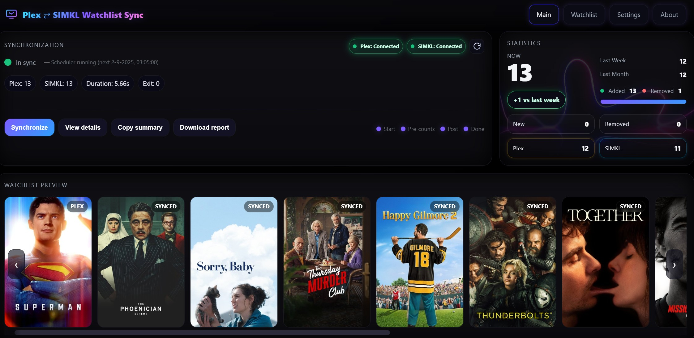
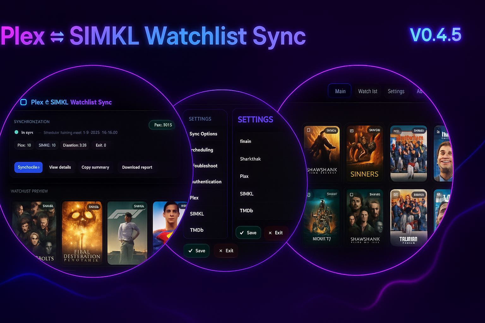
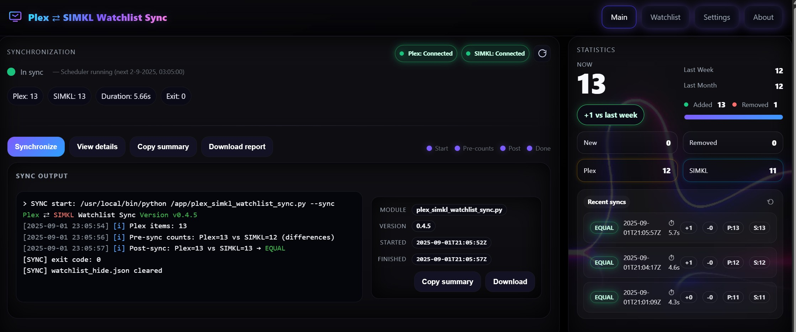

<p align="center">
  
  
  
</p>

## Why I built this

I use both **Plex** and **SIMKL** to track what I watch, but their watchlists are completely separate.  
Adding a movie or show in one place doesn’t appear in the other, and keeping them in sync manually is a hassle.

This project solves that by treating the two watchlists as **one connected system**:

- Adding/removing in **Plex** automatically syncs to **SIMKL**.  
- Adding/removing in **SIMKL** automatically syncs to **Plex**.  
- The result is a single, unified watchlist that stays in sync automatically.

It also works perfectly in combination with my other project:  
👉 [plex-watchlist](https://github.com/cenodude/plex-watchlist) — which automatically removes movies/shows from your Plex Watchlist once you’ve watched them.  

Together, the two tools make life much easier:  
you get **one shared watchlist across Plex and SIMKL**, and it automatically **cleans itself up after you watch something**.  

## ✅ Features

- **Modern Web Interface**  
  A sleek, easy-to-use dashboard to control sync operations, monitor live progress, and explore your unified watchlist.  
  Designed to look great out of the box — no command line required.

- **Two-way sync** between Plex and SIMKL  
  Keep both watchlists in lockstep so you can add or remove items from either side.

- **Flexible sync modes**  
  - **`two-way` (default)** — symmetric sync  
    - **First run:** *adds only* (creates a local snapshot to avoid accidental deletions).  
    - **Subsequent runs:** *adds and deletions* both ways, based on deltas vs the snapshot.  
  - **`mirror`** — makes one side exactly match the other (adds + deletions) using `source_of_truth` (`plex` or `simkl`).

- **Built-in authentication modules**  
  Seamless setup for **Plex**, **SIMKL**, and **TMDb** accounts.

- **Perfect combo with [plex-watchlist](https://github.com/cenodude/plex-watchlist)**  
  Automatically cleans up your Plex Watchlist once items are watched — leaving you with a single, unified watchlist across Plex and SIMKL that also stays tidy without manual effort.

---

## 🚀 Getting Started

You can run **Plex ⇄ SIMKL Watchlist Sync** in two ways (webapp and CLI):

### Option A — Docker (recommended for servers/NAS)

The **Docker** option automates the setup, providing a containerized solution with easy configuration and minimal setup.

#### Docker Setup:

**1. Pull the Docker image:**
```bash
docker pull ghcr.io/cenodude/plex-simkl-watchlist-sync:latest
```

**2. Run the container:**
```bash
docker run -d \
  --name watchlist-sync \
  -p 8787:8787 \
  -v "$PWD/config:/config" \
  -e TZ="Europe/Amsterdam" \
  -e WEBINTERFACE=yes \
  ghcr.io/cenodude/plex-simkl-watchlist-sync:latest
```

Alternatively, use **Docker-Compose** for easier management:

```yaml
version: "3.8"

services:
  watchlist-sync:
    image: ghcr.io/cenodude/plex-simkl-watchlist-sync:latest
    container_name: plex-simkl-sync
    environment:
      TZ: Europe/Amsterdam
      WEBINTERFACE: yes
    volumes:
      - ./config:/config
    ports:
      - "8787:8787"
    restart: unless-stopped
```

#### First-Time Setup:

1. After container starts, a `config.json` is created inside `./config/`.
2. If you’re using the web app, simply configure it through the web interface and you’re all set.
  
If you’d prefer not to use the web app, please read on:  
     - **Edit `config.json`** to add:
     - Your **Plex account token** (use `plex_token_helper.py` if needed).
     - Your **SIMKL client_id** and **client_secret** (SIMKL Developer - [Create an app here](https://simkl.com/settings/developer/new/)).
     - Restart the container.

#### First-Time Setup (SIMKL authorization):

- On restart, the container will show a **SIMKL authorization URL**.
- 👉 IMPORTANT: Copy this exact URL into your SIMKL app settings under *Redirect URIs*.
- Open this URL in your browser and complete login.
- Tokens will be automatically saved in `./config/config.json`.
- Restart the container again and you're ready.

#### Notes:

- Default sync runs every 24 hours. Change with:
  ```bash
  -e CRON_SCHEDULE="*/15 * * * *"
  ```

---

### Option B — Manual Python Setup

If you prefer **manual Python** setup without Docker, follow the instructions below.

#### Requirements:

- **Python 3.8+**
- Install dependencies:
  ```bash
  pip install fastapi uvicorn requests plexapi python-dotenv pydantic[dotenv] aiofiles

  ```

- A `config.json` will be auto-created on first run.

#### First-Time Setup:

If you’re using the web app, simply configure it through the web interface and you’re all set.

If you’d prefer not to use the web app, please read on:  

1. **Create `config.json`:**
   ```bash
   python plex_simkl_watchlist_sync.py
   ```

2. **Edit `config.json`** to add:
   - Your **Plex account token** or use the embedded (`plex_token_helper.py`).
   - Your **SIMKL client_id** and **client_secret** (from SIMKL Developer - [Create an app here](https://simkl.com/settings/developer/new/)).

#### SIMKL Authorization:

Before you can sync, link this tool to your SIMKL account with a one-time setup.

Run:
```bash
python plex_simkl_watchlist_sync.py --init-simkl redirect --bind 0.0.0.0:8787
```

- `--init-simkl redirect` → Starts a local helper that will receive the SIMKL login response.
- `--bind 0.0.0.0:8787` → Tells the helper where to listen for the login.

After running, the script prints the **callback URL** like:
```
http://192.168.1.23:8787/callback
```

👉 **Copy this exact URL into your SIMKL app settings** under *Redirect URIs*.

Then run sync normally:
```bash
python plex_simkl_watchlist_sync.py --sync
```

---

## **Web Interface**

Starting with version **0.4.0**, you can also use a **web interface** to manage the sync process.

### **In Docker**:

By default, the `WEBINTERFACE` is set to **`yes`** in Docker, meaning the web interface will automatically be started. The web UI can be accessed on port **8787**.

To run the web interface with Docker, just ensure the environment variable `WEBINTERFACE` is set to `yes`:
```bash
docker run -d --name watchlist-sync   -p 8787:8787   -v "$PWD/config:/config"   -e TZ="Europe/Amsterdam"   -e WEBINTERFACE="yes"   ghcr.io/cenodude/plex-simkl-watchlist-sync:latest
```

### **Outside Docker** (manual):

If running manually (outside Docker), the **webapp.py** file is used to start the web interface:
```bash
python webapp.py
```

This will start a FastAPI-based server, and you can access the web interface on **http://127.0.0.1:8787** by default.

---

## 🔐 SIMKL APP

### 1) Create your SIMKL app
- Go to **simkl.com → Settings → Developers** and create an app or [Create a SIMKL app here](https://simkl.com/settings/developer/new/).
- Add the **exact** redirect URI you will use:
  ```
  http://<HOST>:8787/callback
  ```

---

## 🎟 Getting a Plex account token

This project requires a **Plex account token** (`plex.account_token`) stored in `config.json`.

Run:

```bash
python plex_token_helper.py --fetch
```

---
 **TMDb Integration (optional, but highly recommended)**  
 Enrich your watchlist preview with beautiful posters, titles, genres, and descriptions powered by [TMDb](https://www.themoviedb.org/).  
When enabled, the Web Interface becomes a vibrant, poster-driven gallery that makes browsing your Plex ⇄ SIMKL watchlist a joy.  

  👉 Get your free API key here: [TMDb API Settings](https://www.themoviedb.org/settings/api)  
  *(This product uses the TMDb API but is not endorsed or certified by TMDb.)*


## 🖥️ Usage

Show help (and all examples/flags):

```bash
./plex_simkl_watchlist_sync.py --help
```

### CLI flags

```
--sync                         Run synchronization using config.json
--init-simkl redirect          Start local redirect helper for SIMKL OAuth
--bind HOST:PORT               Bind address for redirect helper (default 0.0.0.0:8787)
--open                         Try to open the SIMKL auth URL on this device
--plex-account-token TOKEN     Override Plex token from config.json for this run
--debug                        Verbose logging
--version                      Print script and plexapi versions
--reset-state                  Delete state.json (next --sync will re-seed safely)
```

---

## 🗃️ Files the script writes

- `config.json` — your configuration + SIMKL tokens.
- `state.json` — local snapshot that enables **real two-way deletions** on subsequent runs.

---

## 🛠️ Troubleshooting

### Out-of-sync or repeated `NOT EQUAL`
If a run fails partway or the two lists drift, reset and switch to mirror mode temporarily, then return to two-way sync. 

---

## 📣 Support

Issues and suggestions are welcome. When reporting problems, include:
- Your Python version and OS
- `plexapi` version
- Whether you ran with `--debug`
- Redacted logs that show the failing operation

---

## 🔒 Disclaimer

This project is **community-made** and is **not affiliated with Plex or SIMKL**. Use it at your own risk.
